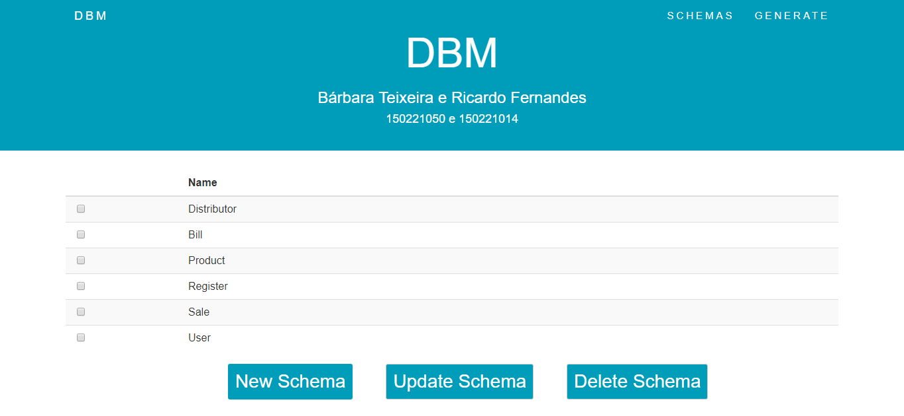

#    Desenvolvimento Baseado em Modelos - Manual Utilizador

### 150221050 Bárbara Teixeira | 150221014 Ricardo Fernandes
----------

## Schemas
Assim que a aplicação é iniciada, esta irá apresentar uma página principal como a da *figura1*, esta página diponibiliza uma tabela com todos os Schemas criados até ao momento, debaixo da mesma encontrará três botões para efetuar as operações CRUD, ou seja, criar um novo Schema, editar um Schema ou eliminar um Schema já existente.

