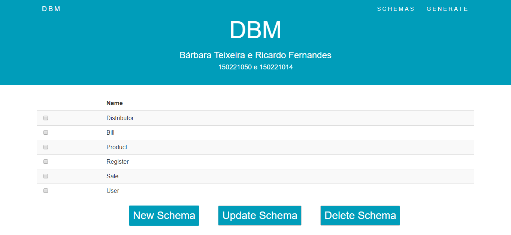

#    Desenvolvimento Baseado em Modelos - Manual Utilizador

### 150221050 Bárbara Teixeira | 150221014 Ricardo Fernandes
----------

## Schemas
Assim que a aplicação é iniciada, esta irá apresentar uma página principal como a da *figura 1*, esta página diponibiliza uma tabela com todos os modelos criados até ao momento, debaixo da mesma encontrará três botões para efetuar as operações CRUD, ou seja, criar, editar ou eliminar um modelo.

**Figura 1** - Página Inicial

Caso selecione o botão **New Schema** irá visualizar o ecrã da *figura 2*, este ecrã contém um formulário com vários campos relacionados com o modelo que quer criar, como por exemplo o seu título, o seu tipo, as suas propriedades, entre outros. Depois de todos os campos preenchidos clique em Submeter

**Figura 2** - Formulário para adicionar um *Modelo*